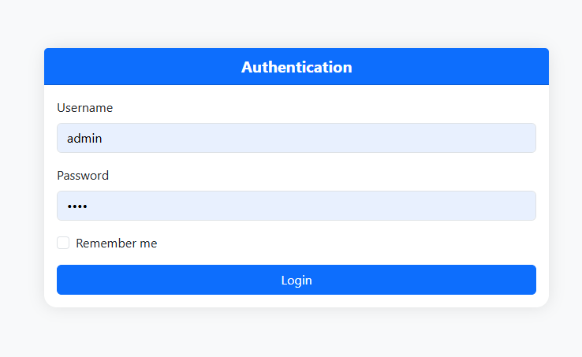
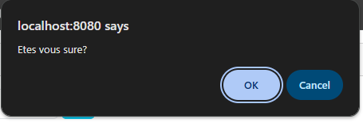

## Activité Pratique N°3 - Spring MVC, Spring Data JPA Thymeleaf
Réalisé par ``Oussama KHOUYA``

L'objectif de cette activité est de créer une page web pour gérer des patients à l'aide du moteur de template Thymeleaf.

### Créer un project springboot avec les bibliothèque Spring Web, Thylemeaf et Spring Data JPA, Mysql, lombok


### Créer l'entité Patient, son repositories et ajouter des patients à la BD
```java
@Entity @Data @NoArgsConstructor @AllArgsConstructor
public class Patient {

    @Id @GeneratedValue(strategy = GenerationType.IDENTITY)
    private Long id;
    private String nom;
    private Date dateNaissance;
    private boolean malade;
    private int score;
}
// Repository
public interface PatientRepository extends JpaRepository<Patient, Long> {}

// Ajouter des patients au démarrage de l'application
@SpringBootApplication
public class HopitalApplication implements CommandLineRunner {
    
    @Autowired
    private PatientRepository patientRepo;

    @Override
    public void run(String... args) throws Exception {
        patientRepo.save(new Patient(null, "Ali", new Date(), true, 80));
        patientRepo.save(new Patient(null, "Fatima", new Date(), false, 95));
        patientRepo.save(new Patient(null, "Omar", new Date(), true, 60));
    }
    }
```
### Créer un controller pou afficher les patients dans une page HTML
```java
@Controller @AllArgsConstructor
public class PatientController {

    private PatientRepository patientRepo;

    @GetMapping("/index")
    public String index(Model model){
        model.addAttribute("listPatients", patientRepo.findAll());
        return "patients";
    }
}
```
- Créer un fichier [patients.html](src/main/resources/templates/patients.html) dans resources/templates
```html
<!doctype html>
<html lang="en" xmlns:th="http://www.thymeleaf.org">
<head>
    <meta charset="UTF-8">
    <title>Patients</title>
    <link rel="stylesheet" href="/webjars/bootstrap/5.3.3/css/bootstrap.min.css">
</head>
<body>
<h2>List patients</h2>

<table class="table">
    <thead>
    <tr>
        <th>ID</th>
        <th>Nom</th>
        <th>Date</th>
        <th>Malade</th>
        <th>Score</th>
    </tr>
    </thead>
    <tbody>
    <tr th:each="p:${listPatients}">
        <td th:text="${p.id}"></td>
        <td th:text="${p.nom}"></td>
        <td th:text="${p.dateNaissance}"></td>
        <td th:text="${p.malade}"></td>
        <td th:text="${p.score}"></td>
    </tr>
    </tbody>
</table>
</body>
</html>
```

### Ajouter la pagination au tableau
- On ajoute ma methode **PageRequest.of(page, size)** à notre code
```java
@Controller
@AllArgsConstructor
public class PatientController {

    private PatientRepository patientRepo;

    @GetMapping("/index")
    public String index(Model model,
                        @RequestParam(name = "page", defaultValue = "0") int page,
                        @RequestParam(name = "size", defaultValue = "4")int size){
        Page<Patient> pagePatients = patientRepo.findAll(PageRequest.of(page, size));
        model.addAttribute("listPatients", pagePatients.getContent());
        model.addAttribute("pages", new int[pagePatients.getTotalPages()]);
        model.addAttribute("currentPage", page);
        return "patients";
    }
}
```
- On ajoute la pagination au-dessous de tableau
```html
<ul class="nav nav-pills">
                <li th:each="page,status:${pages}">
                    <a th:href="@{/index(page=${status.index})}"
                       th:class="${status.index == currentPage} ? 'btn btn-info ms-1' : 'btn btn-outline-info ms-1'"
                       th:text="${status.index}"></a>
                </li>
            </ul>
```

### Recherher un patient par nom
- On ajoute la method **findPatientsByNomContaining** dans le repository
```java
public interface PatientRepository extends JpaRepository<Patient, Long> {

    Page<Patient> findPatientsByNomContaining(String keyword, Pageable pageable);


    @Query("select p from Patient p where p.nom like :x")
    Page<Patient> chercher(@Param("x") String keyword, Pageable pageable);
}
```
- On remplace la methode **findAll** par **findPatientsByNomContaining**
```java
 @GetMapping("/index")
    public String index(Model model,
                        @RequestParam(name = "page", defaultValue = "0") int page,
                        @RequestParam(name = "size", defaultValue = "4")int size,
                        @RequestParam(name = "keyword", defaultValue = "")String keyword){
        Page<Patient> pagePatients = patientRepo.findPatientsByNomContaining(keyword, PageRequest.of(page, size));
        model.addAttribute("listPatients", pagePatients.getContent());
        model.addAttribute("pages", new int[pagePatients.getTotalPages()]);
        model.addAttribute("currentPage", page);
        model.addAttribute("keyword", keyword);
        return "patients";
    }
```
- On ajoute le formulaire dans la page HTML
```html
<form th:action="@{index}" method="get">
    <label>
        keyword:
        <input type="text" name="keyword" th:value="${keyword}">
    </label>
    <button type="submit" class="btn btn-info">Chercher</button>
</form>
```


### Supprimer un patient
- On ajoute une méthode pour la suppression
````java
 @GetMapping("/delete")
public String delete(Long id, String keyword, int page){
    patientRepo.deleteById(id);
    return "redirect:/index?page=" + page + "&keyword=" + keyword;
}
````
- On ajoute une boutton delete dans chaque ligne du tableau
````html
  <td>
    <a onclick="javascript:return confirm('Etes vous sure?')"
       th:href="@{delete(id=${p.id}, keyword=${keyword}, page=${currentPage})}"
       class="btn btn-danger">
        <i class="bi bi-trash"></i>
    </a>
</td>
````



